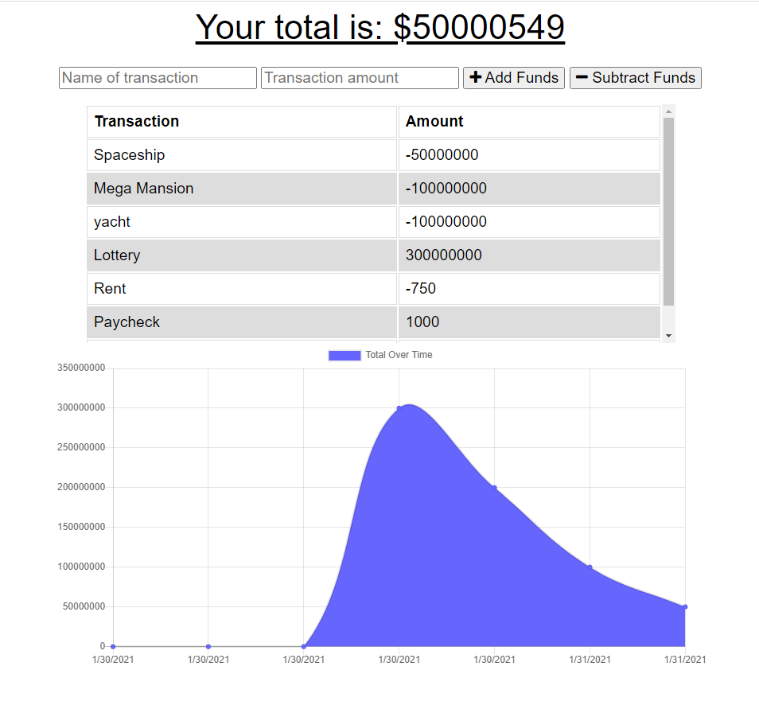

# Budget Tracker

## Description of the Website
This website is designed to be able to track your budget over time by adding individual transactions.

 

## How it Works
* Simply add the name of the transaction and the transaction amount into the input fields and click the Add Funds or Subtract Funds button to have the transaction added to the transaction list and graph.

 

## Website Features
* Website is also a PWA and includes a web manifest.
* Site has offline capabilities 
    * Uses Service Worker to populate the page if no network is available.
    * Uses IndexedDB to collect new data if no network is available, and then upload the data once the connection is restored.

  
 

## Link to Budget Tracker Website
https://uw-bootcamp-budget-tracker.herokuapp.com/

 

## How the Website Looks on a Desktop Display

 

## Credits

*Addition of Service Worker, IndexedDB functionality, and web manifest completed by Chris Wein. All other code was given at start of project.